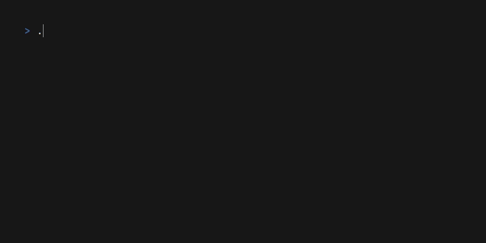

# plaque

`plaque`

- is a simple TUI application to manage a queue of albums (more accurately,
  directories)
- is designed to do its thing and get out of the way
- has a single dependency: [`mpv`](https://mpv.io/)
- has optional support for rating albums on [Discogs](https://www.discogs.com/)
- is **not** a music library organiser
